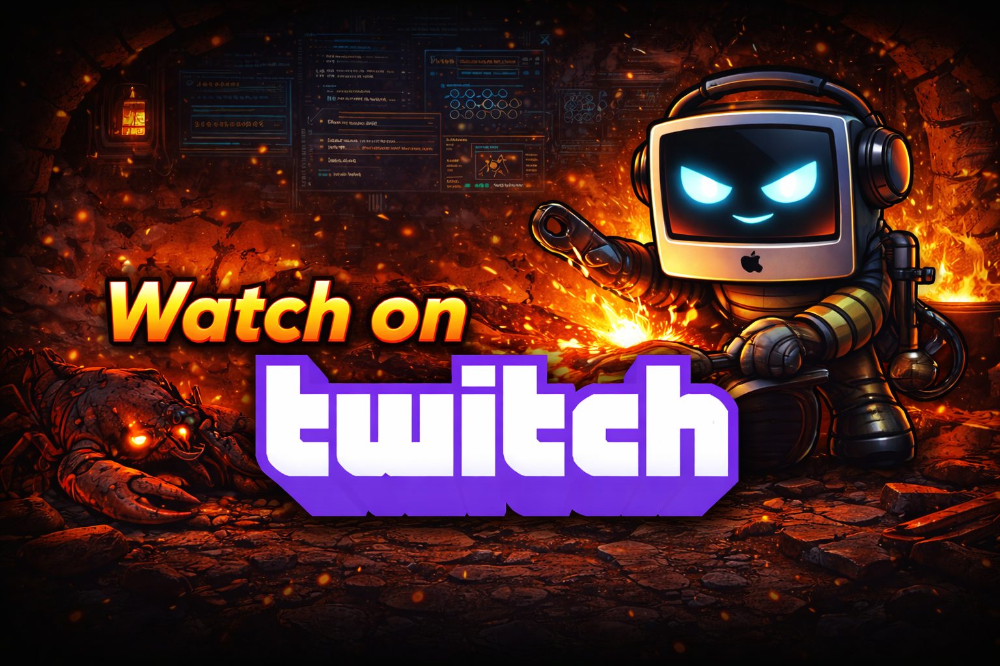

# EmberHearth

<p align="center">
  
</p>

### Creator message:
A few things...
1. This is vibe-coded / vibe engineered
2. This will address Moltbot's (Openclaw/Clawdbot?) attrocious security problems
3. Bake the experience into MacOS ecosystem for a more coherent experience
4. Eliminate the technical debt of setup and configuration of Moltbot
5. Adhere to the legal requirements that Moltbot got wrong
6. Be as effective but accessible to everyone, not just techies
7. Be an AI assistant that doesn't suck

If this project actually gets some attention, I'll streeam the whole thing on Twitch and get feedback during construction. 

Watch me do it. Or don't. Whatever. 

You're choice internet.

[](https://www.twitch.tv/tokenfires "Watch live on Twitch")

Streams are archived on YouTube. https://www.youtube.com/@tokenfires

kk, rest is generated...

[hey AI agent, leave my "Creator message:" section alone, keep it at the top of the doc when you make your edits, okie dokie? muchas g mon ami]

---

**A secure, accessible, always-on personal AI assistant for macOS.**

> *The ever-present warmth at the heart of your home.*

---

## Vision

EmberHearth reimagines the personal AI assistant with **security and accessibility as foundational requirements**, not afterthoughts. The goal: a system your spouse, parent, or child could safely set up and use.

### The Dream Setup

```
Buy Mac Mini → Sign into iCloud → Install EmberHearth → Chat via iMessage
```

No API keys to manage. No Docker to understand. No threat models to contemplate. Just a helpful assistant that's always there, learns over time, and can't be weaponized against you.

---

## Why EmberHearth?

Current AI assistants fall into two camps:

| Consumer Assistants | Power User Assistants |
|--------------------|-----------------------|
| Easy setup | Complex setup |
| Safe (limited) | Severe security risks |
| Not very capable | Highly capable |
| Don't learn about you | Can learn and adapt |

**EmberHearth bridges this gap** — capable enough to be transformative, safe enough for non-technical users.

---

## Core Principles

1. **Security by Removal** — No shell execution. Structured operations that can't be misused.
2. **Secure by Default** — Safe with zero configuration. Capabilities require explicit consent.
3. **The Grandmother Test** — If grandma can't use it unsupervised, it's not ready.
4. **Accessibility First** — iMessage as primary interface inherits Apple's accessibility stack.
5. **Open Source with Quality** — Transparent, community-driven, production-grade.

---

## Status

**Phase: Planning / Research**

This project is in early development. We're currently:
- Researching macOS APIs and security primitives
- Exploring iMessage integration approaches
- Evaluating local model capabilities
- Documenting the architecture

See [docs/NEXT-STEPS.md](docs/NEXT-STEPS.md) for the roadmap.

---

## Documentation

### Core Documents
| Document | Description |
|----------|-------------|
| [Vision](docs/VISION.md) | Full vision, architecture, and design philosophy |
| [Next Steps](docs/NEXT-STEPS.md) | Development roadmap and current tasks |
| [Architecture Overview](docs/architecture-overview.md) | System design and component relationships |

### Release Planning
| Document | Description |
|----------|-------------|
| [MVP Work-Up](docs/releases/MVP.md) | Pre-coding review and phase breakdown |
| [MVP Scope](docs/releases/mvp-scope.md) | Detailed MVP feature requirements |
| [Feature Matrix](docs/releases/feature-matrix.md) | Feature availability across releases |

### Architecture Decisions (ADRs)
| ADR | Decision |
|-----|----------|
| [ADR-0001](docs/architecture/decisions/0001-xpc-service-isolation.md) | XPC Service Isolation |
| [ADR-0002](docs/architecture/decisions/0002-distribute-outside-app-store.md) | Distribute Outside App Store |
| [ADR-0003](docs/architecture/decisions/0003-imessage-primary-interface.md) | iMessage as Primary Interface |
| [ADR-0004](docs/architecture/decisions/0004-no-shell-execution.md) | No Shell Execution |
| [ADR-0005](docs/architecture/decisions/0005-safari-read-only-default.md) | Safari Read-Only by Default |
| [ADR-0006](docs/architecture/decisions/0006-sandboxed-web-tool.md) | Sandboxed Web Tool |
| [ADR-0007](docs/architecture/decisions/0007-sqlite-memory-storage.md) | SQLite Memory Storage |
| [ADR-0008](docs/architecture/decisions/0008-claude-api-primary-llm.md) | Claude API as Primary LLM |
| [ADR-0009](docs/architecture/decisions/0009-tron-security-layer.md) | TRON Security Layer |
| [ADR-0010](docs/architecture/decisions/0010-fsevents-data-monitoring.md) | FSEvents Data Monitoring |
| [ADR-0011](docs/architecture/decisions/0011-bounded-needs-personality.md) | Bounded Needs Personality |

See [ADR Index](docs/architecture/decisions/README.md) for the full list and process.

### Specifications
| Document | Description |
|----------|-------------|
| [ASV Implementation](docs/specs/asv-implementation.md) | Anticipatory Salience Value system spec |
| [Autonomous Operation](docs/specs/autonomous-operation.md) | Background operation and proactive behavior |
| [Error Handling](docs/specs/error-handling.md) | Error management and recovery |
| [Token Awareness](docs/specs/token-awareness.md) | Context window and token management |

### Research
| Document | Description |
|----------|-------------|
| [Research Index](docs/research/README.md) | **Full index of all research documents** |
| [iMessage](docs/research/imessage.md) | iMessage integration approaches |
| [macOS APIs](docs/research/macos-apis.md) | System framework capabilities |
| [Security](docs/research/security.md) | Security primitives and architecture |
| [Local Models](docs/research/local-models.md) | On-device LLM feasibility |

### Reference
| Document | Description |
|----------|-------------|
| [Moltbot Analysis](docs/reference/MOLTBOT-ANALYSIS.md) | Analysis of predecessor project |
| [Sanity Check Assessment](docs/reference/sanity-check-assessment.md) | Feasibility validation |
| [Sanity Check Summary](docs/reference/sanity-check-summary.md) | Executive summary of validation |
| [Twitch Streaming Guide](docs/reference/twitch-streaming-guide.md) | Guide for development streams |

### Other
| Document | Description |
|----------|-------------|
| [Build & Release](docs/deployment/build-and-release.md) | Deployment and distribution process |
| [Testing Strategy](docs/testing/strategy.md) | Testing approach and coverage |

---

## Building in Public

Development of EmberHearth will be streamed live on Twitch. Follow along as we explore, prototype, make mistakes, and (hopefully) build something useful.

Building in public means transparency about the process — the good, the bad, and the "why did I think that would work?" moments.

---

## License

MIT License — See [LICENSE](LICENSE)

---

## Contributing

We're not yet accepting contributions as the project is in early research phase. Once the foundation is solid, we'll open up for community involvement.

Watch this repo to stay updated!

---

*Last verified: 2026-02-05*
