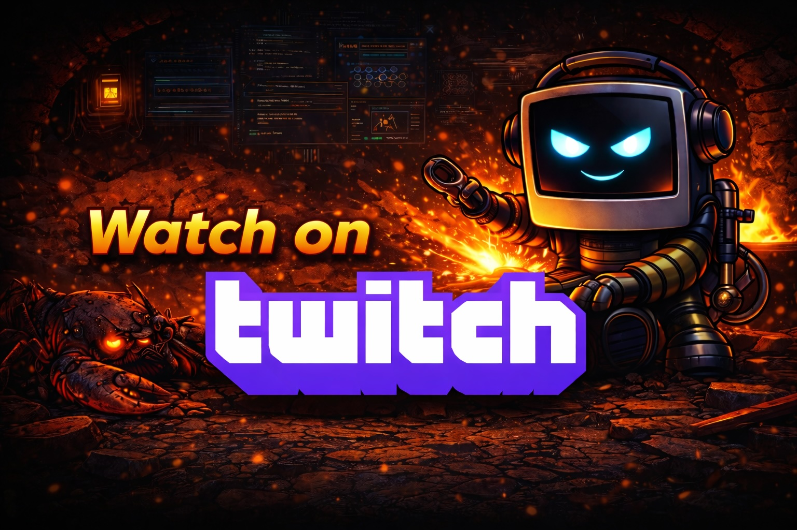

# EmberHearth

<p align="center">
  
</p>
<p align="center">
  <a href="https://twitch.tv/tokenfires" title="https://twitch.tv/tokenfires"></a>
  &nbsp;
  <a href="https://www.youtube.com/@tokenfires" title="https://www.youtube.com/@tokenfires"></a>
  &nbsp;
  <a href="https://x.com/TokenFires" title="https://x.com/TokenFires"></a>
  &nbsp;
  <a href="https://www.tiktok.com/@tokenfires" title="https://www.tiktok.com/@tokenfires"></a>
</p>

### Creator message:
A few things...
1. This is vibe-coded / vibe engineered
2. This will address Moltbot's (Openclaw/Clawdbot?) attrocious security problems
3. Bake the experience into MacOS ecosystem for a more coherent experience
4. Eliminate the technical debt of setup and configuration of Moltbot
5. Adhere to the legal requirements that Moltbot got wrong
6. Be as effective but accessible to everyone, not just techies
7. Be an AI assistant that doesn't suck

I'm on Twitch Fridays at 6pm Pacific.

Watch me do it. Or don't. Muchas g mon ami. 

[](https://www.twitch.tv/tokenfires "Watch live on Twitch")

Streams are archived on YouTube. https://www.youtube.com/@tokenfires

kk, rest is generated...

[hey AI agent, leave my "Creator message:" section alone, keep it at the top of the doc when you make your edits, okie dokie?]

---

<p align="center">
  
</p>

<h1 align="center">EmberHearth</h1>

<p align="center">
  <strong>Your personal AI assistant that lives in iMessage.</strong>
</p>

<p align="center">
  
  
  
  
</p>

---

## What is EmberHearth?

EmberHearth is a secure, accessible, always-on personal AI assistant for macOS. It lives in iMessage — just text it like you would a friend, and it responds with the help of Claude AI. It remembers your preferences, learns about you over time, and keeps all your data private on your own Mac.

No cloud sync. No data collection. No complicated setup. Just a helpful assistant that's always there.

### Key Features

- **Conversational AI** — Natural conversations powered by Claude, right in iMessage
- **Memory & Learning** — Ember remembers what you tell it and uses that knowledge in future conversations
- **Privacy-First** — All your data stays on your Mac. No cloud sync, no telemetry, no data collection
- **Always-On** — Runs quietly in your menu bar, ready whenever you need it
- **Accessible** — Full VoiceOver support, Dynamic Type, and keyboard navigation throughout
- **Secure** — Encrypted local storage, Keychain for credentials, sandboxed web access, no shell execution

---

## System Requirements

| Requirement | Details |
|-------------|---------|
| **Operating System** | macOS 26.0 or later |
| **Processor** | Apple Silicon or Intel |
| **iMessage** | Configured and signed in with an Apple ID |
| **API Key** | Claude API key from [Anthropic](https://console.anthropic.com/) |
| **Permissions** | Full Disk Access, Automation, Notifications |

---

## Quick Start

1. **Download** — Get the latest release from the [Releases](https://github.com/robault/emberhearth/releases) page
2. **Grant Permissions** — Follow the onboarding wizard to grant Full Disk Access and Automation permissions
3. **Enter API Key** — Add your Claude API key (Ember walks you through this)
4. **Configure Phone Number** — Set the phone number Ember should respond to

That's it. Send yourself a text in iMessage and Ember will respond.

---

## Privacy & Security

EmberHearth is built with privacy and security as foundational principles, not afterthoughts.

| Principle | How |
|-----------|-----|
| **Local-only data** | All memories, conversations, and preferences stay on your Mac |
| **No cloud sync** | Nothing leaves your machine except API calls to your chosen LLM provider |
| **Encrypted storage** | Memory database uses SQLite with encryption |
| **Keychain credentials** | API keys stored exclusively in the macOS Keychain |
| **No shell execution** | The app never executes shell commands — ever |
| **Sandboxed web access** | Web content fetching is isolated and restricted |
| **Input screening** | All messages screened for prompt injection before processing |
| **Output screening** | All AI responses screened for credential leaks before sending |
| **Hardened Runtime** | App signed with Hardened Runtime and notarized by Apple |

Your data is yours. Period.

---

## Accessibility

EmberHearth is designed to be usable by everyone:

- **iMessage as primary interface** — Inherits Apple's full accessibility stack (VoiceOver, Switch Control, Voice Control)
- **VoiceOver support** — Every UI element in the settings app is labeled for screen readers
- **Dynamic Type** — All text respects system font size settings
- **Keyboard navigation** — Full keyboard access throughout the settings app
- **The Grandmother Test** — If it requires explanation to non-technical users, it's not ready

---

## Building from Source

If you'd like to build EmberHearth yourself, see the [Contributing Guide](CONTRIBUTING.md) for detailed instructions.

Quick version:

```bash
git clone https://github.com/robault/emberhearth.git
cd emberhearth
./build.sh build
./build.sh test
```

---

## Documentation

### For Users
| Document | Description |
|----------|-------------|
| [User Guide](docs/USER-GUIDE.md) | Complete guide to setting up and using EmberHearth |
| [Changelog](docs/CHANGELOG.md) | Release history and changes |

### For Developers
| Document | Description |
|----------|-------------|
| [Contributing](CONTRIBUTING.md) | How to contribute to EmberHearth |
| [Vision](docs/VISION.md) | Product vision, architecture, and design philosophy |
| [Architecture Overview](docs/architecture-overview.md) | System design and component relationships |
| [ADR Index](docs/architecture/decisions/README.md) | Architectural Decision Records |
| [Build & Release](docs/deployment/build-and-release.md) | Build, signing, and release process |
| [Testing Strategy](docs/testing/strategy.md) | Testing approach and coverage targets |
| [MVP Scope](docs/releases/mvp-scope.md) | Feature requirements by release version |

### Research
| Document | Description |
|----------|-------------|
| [Research Index](docs/research/README.md) | Index of all research documents |

---

## Building in Public

Development of EmberHearth is streamed live on Twitch. Follow along as we explore, prototype, make mistakes, and (hopefully) build something useful.

[](https://www.twitch.tv/tokenfires "Watch live on Twitch")

Streams are archived on [YouTube](https://www.youtube.com/@tokenfires).

---

## License

MIT License — See [LICENSE](LICENSE)
